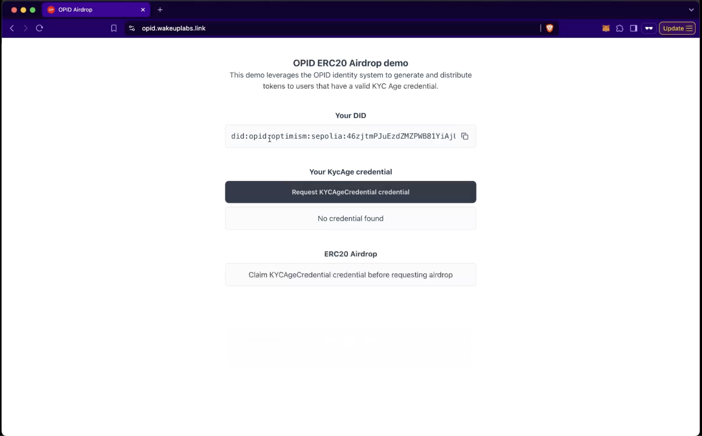
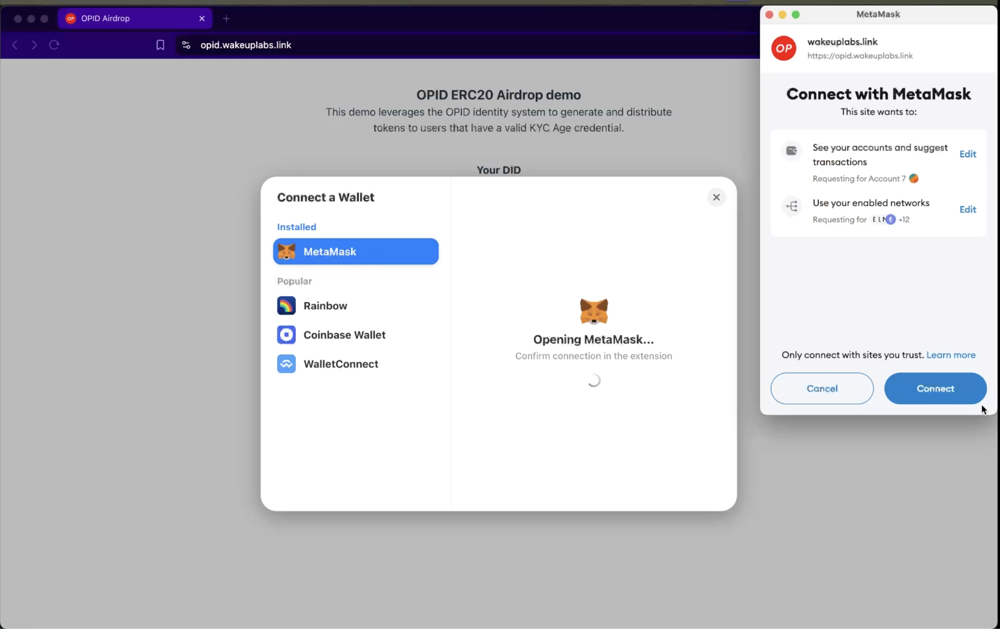

# OPID Zk Erc20 Airdrop Demo

This demo highlights the usage of the Optimism ZK Identity Kit, showcasing an airdrop workflow. using the Selective Disclosure Verifier and the Issuer Node. Users can visit the website, generate a KycAge credential, and later use it to claim the airdrop.

User connects wallet:

One BJJ wallet will be generated for each user. Please note this wallet is just for the demo and proof are associated to this generated wallet so you'll be capable of claiming just once unless you change browser or clean stored data. On the home screen users can copy their DID, see their credentials, check their airdrop balance and the zk requests metadata

For the demo we deployed a contract that mints tokens for those that submit a selective proof disclosure for the age o a KycAge credential. Just for demo porpouses we don't enforce any particular issuer but that can be set. he contracts used for this demo can be found in the [opid-contracts-examples](https://github.com/wakeuplabs-io/opid-contracts-examples) repo in particular the `ERC20SelectiveDisclosureVerifier`.

Also in this particular case, and just to showcase an interaction with the whole system the ui reaches to the issuer service that creates credentials to everyone without distintction. In a real case scenario the issuer should effectivly run some checks to give credibility to his credentials.

So when clicking in `Request KYCAgeCredential credential` we'll emit a valid credential and publish it onchain. We do this from `packages/ui/src/services/kyc-age-issuer.ts`. Again, this is just for demo, in a production case this should NOT be the way, and issuance keys should be protected.

Once we have the KYCAge credential we can see it reflected in "Your credentials" section and can proceed to claim the airdrop.

User will have to pay for the gas of submitting the proof and minting the tokens.

And after transaction was mined balance will be reflected

The full video available here:

<video controls>
  <source src="./assets/demo.mp4" type="video/mp4">
</video>

## Notes

Just for demo porpoises we made the following simplifications
- Identity wallet is created locally and there's no recovery flow. In a real production case users would need to keep their identity safe. 
