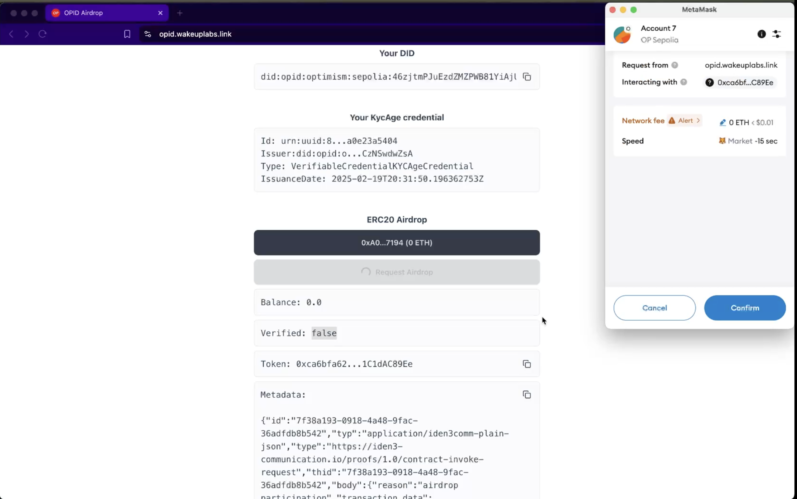

# OPID Zk Erc20 Airdrop Demo

This demo highlights the usage of the Optimism ZK Identity Kit, showcasing an example airdrop application where users proof they were born before certain date to claim the tokens. 

Once users land on the demo website, one BJJ wallet will be generated for them. Please note this wallet is just for the demo and we treat it as disposable. On the home screen users can copy their DID, see their credentials.

Also in this particular case, and just to showcase an interaction with the whole system the ui reaches to the issuer service that creates credentials to everyone without distinction. In a real case scenario the issuer should effectively run some checks to give credibility to his credentials.

So when clicking in `Request KYCAgeCredential credential` we'll emit a credential that certifies we've been born in 1996/04/24. We do this from `packages/ui/src/services/kyc-age-issuer.ts`. Again, this is just for demo, in a production case this should NOT be the way, and issuance keys should be protected.

Once we have the `KYCAgeCredential` we can see it reflected in "Your credentials" section and can proceed to claim the airdrop. The contracts used for this demo can be found in the [opid-contracts-examples](https://github.com/wakeuplabs-io/opid-contracts-examples) repo in particular the `ERC20Verifier`.

User will generate a proof indicating they've been born before 2002/01/01 and will pay for the gas of submitting it and minting the tokens. Here the transaction https://optimism-sepolia.blockscout.com/tx/0x96b62004536767f4bf46fdfa2e246a93f686be9aa5981499bfc2bea420703fee

And after transaction was mined balance will be reflected

The full video available at `/assets/demo.mov`
